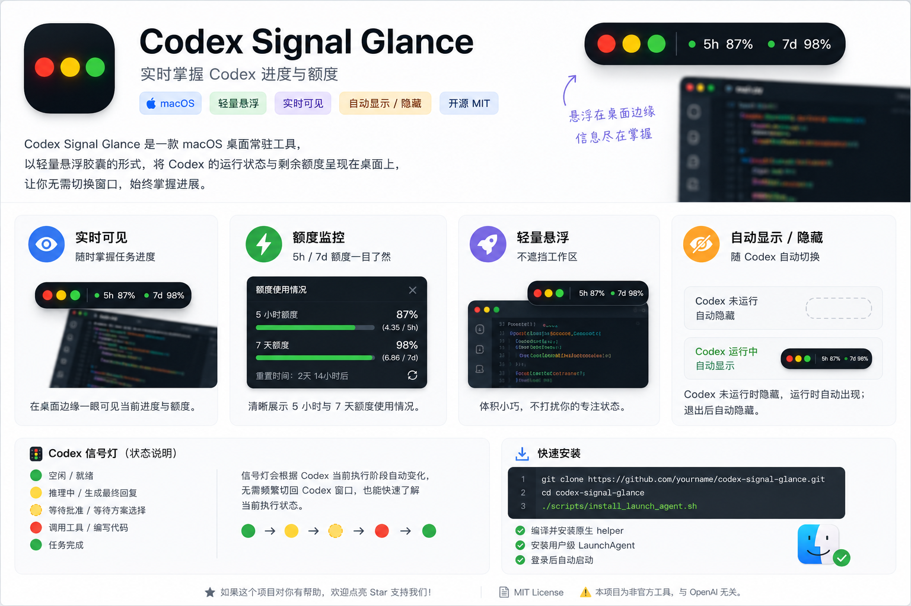

# Codex Signal Glance

> How much quota is left? What is Codex doing right now? These details should be visible at a glance—not buried in settings or another window.
>
> Codex Signal Glance is a lightweight macOS desktop companion that keeps your Codex activity and remaining quota in view, so you can stay focused while always knowing what's happening.

> 额度还剩多少？任务进行到哪一步？这些信息本应一眼可见，而不是藏在设置页面和窗口切换之间。
>
>Codex Signal Glance 是一款 macOS 桌面常驻工具。作为登录项运行，它会将 Codex 的运行状态与剩余额度持续呈现在桌面上，让你无需切换窗口，始终掌握进展。



## What It Does

Codex Signal Glance keeps your Codex quota and activity status visible in a lightweight floating desktop capsule.

It shows:


- 5-hour / 7-day quota usage.
- Relative quota pace (Ahead / Comfortable).
- Current Codex execution status.
- Click for detailed quota information.
- Auto show/hide with Codex.


---

## 它能做什么

Codex Signal Glance 会以轻量悬浮胶囊的形式显示 Codex 的额度与运行状态。

它可以显示：

- 5 小时 / 7 天额度使用情况。
- 相对额度节奏（超前 / 宽裕）。
- 当前 Codex 执行状态。
- 点击查看详细额度信息。
- 随 Codex 自动显示/隐藏。

---

## Why

>Codex quota and activity status often live outside your workflow.
>
>Checking remaining quota means digging through settings, while checking progress usually requires switching back to the Codex window and interrupting what you're doing.

Codex Signal Glance brings these essential details back into view.
By keeping your Codex activity and remaining quota visible in a lightweight, persistent desktop companion, it lets you stay informed without constantly switching windows—so you can stay focused on your work.

## 为什么需要它

>Codex 的额度与运行状态，常常藏在当前工作流之外。
>
>查看剩余额度，需要进入设置页面层层查找；确认任务进度，也往往意味着切回窗口、打断手头工作。

Codex Signal Glance 将这些关键信息带回桌面视野。
它以轻量、持续的方式呈现 Codex 的运行状态与剩余额度，让你无需频繁切换窗口，也能随时掌握当前进展，保持专注。

---


## Install

Clone the repo, then run:

```bash
./scripts/install_launch_agent.sh
```

This will:

- Build the native helper.
- Copy the binary to `~/.codex-quota-widget/bin`.
- Install a user-level LaunchAgent.
- Start the helper immediately.

After installation:

- Starts silently after macOS login.
- Hidden when Codex is not running.
- Widget appears automatically when Codex launches.
- Hides automatically when Codex exits.

### Uninstall

```bash
./scripts/uninstall_launch_agent.sh
```

This stops the helper and removes Codex Signal Glance files, including:

- user-level LaunchAgent
- `~/.codex-quota-widget`
- legacy `~/.codex-signal-glance`
- legacy `~/Applications/Codex Signal Glance.app` if it exists
- legacy Login Item entries if they exist

## 安装使用

进入项目目录后运行：

```bash
./scripts/install_launch_agent.sh
```

该脚本会：

- 编译并安装原生 helper。
- 将程序复制到 `~/.codex-quota-widget/bin`。
- 安装用户级 LaunchAgent。
- 立即启动 helper。

安装完成后：

- 登录 macOS 后自动启动。
- Codex 未运行时保持隐藏。
- 启动 Codex 后自动显示。
- 退出 Codex 后自动隐藏。

### 卸载

```bash
./scripts/uninstall_launch_agent.sh
```

该命令会停止 helper，并清理 Codex Signal Glance 相关文件，包括：

- 用户级 LaunchAgent
- `~/.codex-quota-widget`
- 旧版 `~/.codex-signal-glance`
- 如果存在，旧版 `~/Applications/Codex Signal Glance.app`
- 如果存在，旧版登录项


---

## Codex Signal Light

The signal light changes automatically based on what Codex is doing.

| State | Indicator |
|---------|---------|
| Idle / Ready | 🟢 Green |
| Reasoning | 🟡 Yellow |
| Generating Final Response | 🟡 Yellow |
| Waiting For Approval | 🟡 Blinking Yellow |
| Waiting For Plan Selection | 🟡 Blinking Yellow |
| Calling Tools | 🔴 Red |
| Writing Code | 🔴 Red |
| Task Completed | 🟢 Green |

This allows you to understand Codex activity at a glance without constantly switching back to the Codex window.

## Codex Signal Light（状态灯）

状态灯会根据 Codex 当前执行阶段自动变化。

| 状态 | 指示灯 |
|---------|---------|
| 空闲 / 就绪 | 🟢 绿色 |
| 推理中 | 🟡 黄色 |
| 生成最终回复 | 🟡 黄色 |
| 等待批准 | 🟡 黄色闪烁 |
| 等待方案选择 | 🟡 黄色闪烁 |
| 调用工具 | 🔴 红色 |
| 编写代码 | 🔴 红色 |
| 任务完成 | 🟢 绿色 |

无需频繁切回 Codex 窗口，也能快速了解当前执行状态。

---

## Quota Overview

Codex Signal Glance tracks both the 5-hour and 7-day quota windows.

For each quota period, it shows:

- Percentage used.
- Actual usage amount.
- Current position within the quota cycle.
- Relative quota pace.

### Quota Pace

The quota pace indicator compares your current consumption against an even usage pace across the quota window.

- Ahead 47% → consuming quota 47% faster than the average pace.
- Comfortable 20% → consuming quota more slowly than average, leaving additional headroom.

This helps estimate whether you're likely to exhaust quota early without manually calculating usage trends.

## 额度概览

Codex Signal Glance 会持续追踪 5 小时与 7 天两个额度周期。

对于每个额度周期，会显示：

- 已使用百分比。
- 实际已使用额度。
- 当前所处周期进度位置。
- 相对额度节奏。

### 额度节奏

额度节奏指标会将当前消耗速度与整个额度周期内的平均消耗速度进行比较。

- 超前 47%：当前消耗速度比平均速度快 47%。
- 宽裕 20%：当前消耗速度比平均速度慢 20%，仍有较多可用余量。

通过该指标，可以快速判断当前额度是否存在提前耗尽的风险。

---

## Notes

- Unofficial project and not affiliated with OpenAI.
- Codex local app-server APIs may change in the future.
- Released under the MIT License.

## 注意事项

- 本项目为非官方工具，与 OpenAI 无关。
- Codex 本机 app-server 接口未来可能发生变化。
- 项目采用 MIT License 开源。
